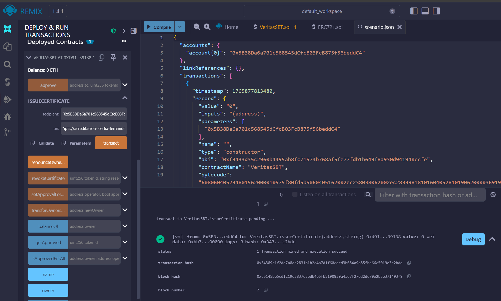

# 🛡️ VERITAS Protocol: Decentralized Academic Certification

## 📄 Descripción Ejecutiva

**Veritas** es un protocolo de Smart Contracts diseñado para erradicar la falsificación de títulos académicos. Utiliza tecnología Blockchain para emitir credenciales digitales inmutables.

A diferencia de los NFTs tradicionales, Veritas implementa la lógica **SBT (Soulbound Token)**:
*   **Intransferible:** El token se vincula matemáticamente a la identidad digital (Wallet) del estudiante.
*   **Perpetuo:** No puede ser vendido, robado ni transferido a terceros.
*   **Verificable:** Cualquier empleador puede auditar la autenticidad en tiempo real en la Blockchain.

## ⚙️ Arquitectura Técnica

El contrato `VeritasSBT.sol` extiende la funcionalidad de **OpenZeppelin 5.0**, implementando bloqueos de seguridad a nivel de protocolo:

1.  **Override de Transferencias:** Se intercepta el hook `_update` y las funciones `transferFrom` / `safeTransferFrom` para impedir cualquier movimiento de activos.
2.  **Role-Based Access Control (RBAC):** Solo la institución emisora (`Owner`) tiene permisos de `Mint` (Emisión) y `Burn` (Revocación).
3.  **Metadatos Descentralizados:** Compatible con el estándar `ERC721URIStorage` para alojar diplomas en **IPFS** (InterPlanetary File System).

## 🚀 Despliegue y Pruebas

El contrato ha sido compilado y probado exitosamente en entornos EVM (Ethereum Virtual Machine).

### Evidencia de Deploy (Remix IDE):

*(Asegúrate de guardar tu captura en la carpeta assets con este nombre)*

## 🛠️ Stack Tecnológico

*   **Lenguaje:** Solidity `^0.8.20`
*   **Estándares:** ERC-721, Ownable, URIStorage
*   **Seguridad:** OpenZeppelin Contracts
*   **IDE:** Remix & VS Code

---
Desarrollado por **Fernando Gutiérrez Berumen** | *Data Scientist & Web3 Specialist*
